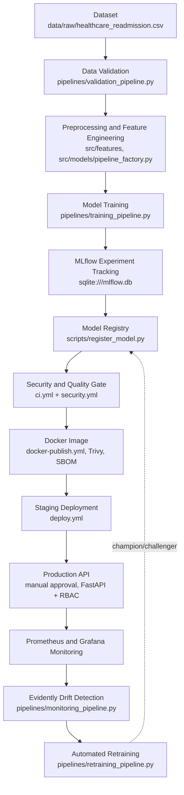

# Healthcare 30-Day Readmission Risk — End-to-End DevSecMLOps

> **Healthcare disclaimer.** This project is for **educational and demonstration
> purposes only**. It is trained on **synthetic** data generated by
> `src/data/generate.py`; no real patient data or personally identifiable
> information is used. It must **not** be used for real clinical diagnosis or
> treatment decisions without professional clinical validation, regulatory
> review and testing on real, governed data.

## Labs covered

This repository is "Internal Project 2". It implements two college labs on one
shared ML system.

| Lab | What it asks for | Where it is implemented | Main document |
|-----|------------------|-------------------------|---------------|
| **Lab 5 — Build a Secure CI/CD Pipeline using GitHub Actions** | Automated build, test, security scanning, image publishing, gated deployment | `.github/workflows/` (`ci.yml`, `security.yml`, `data-validation.yml`, `model-training.yml`, `docker-publish.yml`, `deploy.yml`, `drift-monitoring.yml`, `retraining.yml`), `.github/dependabot.yml`, `.github/CODEOWNERS`, `.pre-commit-config.yaml`, `.gitleaks.toml`, `Dockerfile`, `Makefile` (`make ci`, `make security-scan`), `infrastructure/` | [`docs/ci_cd_pipeline.md`](docs/ci_cd_pipeline.md) |
| **Lab 6 — ML Pipeline with Access Control** | Role-based access to the model API and to the training/retraining pipelines, with audit | `configs/access_control.yaml`, `src/security/rbac.py`, `api/security.py`, `api/main.py`, `pipelines/*_pipeline.py`, `scripts/register_model.py`, `tests/security/test_rbac.py`, `model-training.yml` (`rbac-negative-test` job) | [`docs/access_control.md`](docs/access_control.md) |

The formal lab record (aim, procedure, observations, result, viva questions)
for both labs is in [`docs/LAB_REPORT.md`](docs/LAB_REPORT.md).

**Web UI:** start the API and open `http://127.0.0.1:<port>/ui/`. See
[section 14a](#14a-web-ui-readmission-risk-console) - it is the easiest way to
demonstrate Lab 6 live (sign in as different roles and watch 200 / 401 / 403).

---

## 1. Project overview

A machine-learning service that estimates the probability that a patient will
be readmitted to hospital within 30 days of discharge. The project covers the
full lifecycle: synthetic data generation, data validation, feature
engineering, model training and comparison, experiment tracking (MLflow), data
and model versioning (DVC), a secured REST API (FastAPI), containerisation
(Docker), CI/CD with security gates (GitHub Actions), infrastructure examples
(Terraform, Kubernetes), monitoring (Prometheus, Grafana), drift detection
(Evidently) and drift-triggered retraining.

## 2. Business problem

Unplanned 30-day readmissions are costly and often preventable with better
discharge planning (follow-up appointments, medication review, home care). A
risk score at discharge lets care teams focus scarce follow-up resources on the
patients most likely to come back. Because missing a high-risk patient is worse
than an unnecessary follow-up call, the model is tuned to favour **recall**
(share of real readmissions it catches) over accuracy.

## 3. Main features

- Synthetic dataset: 6,000 patients, 25 features, 17.3% readmitted, realistic missing values and outliers.
- One scikit-learn `Pipeline` (feature engineering + imputation + outlier clipping + scaling + one-hot encoding + calibrated classifier), so training and serving apply identical steps.
- Three models compared (Logistic Regression, Random Forest, XGBoost) with randomized hyperparameter search, class-imbalance handling and isotonic probability calibration.
- Decision threshold chosen for recall, not the default 0.5.
- FastAPI service: single, explained (SHAP) and batch CSV prediction; input validation; request IDs; structured JSON logs; rate limiting; secure headers; upload limits; no stack traces in responses.
- **Lab 6:** API-key authentication + role-based authorization (5 roles), pipeline-level RBAC, JSON audit log.
- **Lab 5:** 8 GitHub Actions workflows with lint, type-check, tests, Bandit, pip-audit, Gitleaks, Checkov, CodeQL, Trivy, SBOM, image signing and manual production approval.
- Prometheus metrics + Grafana dashboard + alert rules; Evidently drift reports; retraining policy with champion/challenger comparison.
- 135 automated tests (unit, integration, security).

## 4. Architecture



More detail (component and CI/CD diagrams): [`docs/architecture.md`](docs/architecture.md).

## 5. Technology stack

| Area | Tools (pinned versions in `requirements*.txt`) |
|------|-----|
| Language / ML | Python 3.11, pandas, NumPy, scikit-learn, XGBoost, SHAP, Matplotlib, joblib |
| API | FastAPI, Pydantic, Uvicorn, slowapi (rate limiting), prometheus_client |
| MLOps | MLflow (tracking + registry), DVC (`dvc.yaml`, `params.yaml`), Evidently (drift), Prefect (flow orchestration) |
| DevOps | Git, GitHub Actions, Docker, Docker Compose, Makefile |
| DevSecOps | ruff, mypy, Bandit, pip-audit, Gitleaks, Trivy, Checkov, CodeQL, Dependabot, pre-commit, Syft SBOM, cosign |
| Infrastructure | Terraform (AWS ECR, S3, KMS example), Kubernetes manifests (Kustomize) |
| Monitoring | Prometheus, Grafana, structured JSON logging |

## 6. Repository structure

Generated from the actual repository (`find`, excluding `.venv`, `.git`,
`mlruns`, caches, and the many timestamped report files).

```
internal_project_2/
├── .github/
│   ├── workflows/
│   │   ├── ci.yml                    # lint, type-check, tests + coverage
│   │   ├── security.yml              # Bandit, pip-audit, Gitleaks, Checkov, CodeQL, Trivy fs
│   │   ├── data-validation.yml
│   │   ├── model-training.yml        # Lab 6: rbac-negative-test + train
│   │   ├── docker-publish.yml        # build, Trivy image, SBOM, GHCR push, cosign
│   │   ├── deploy.yml                # staging -> production (manual approval)
│   │   ├── drift-monitoring.yml      # daily cron
│   │   └── retraining.yml            # weekly cron, RBAC pipeline:retrain
│   ├── ISSUE_TEMPLATE/ (bug_report.md, security_vulnerability.md)
│   ├── CODEOWNERS
│   ├── dependabot.yml
│   └── pull_request_template.md
├── api/
│   ├── main.py                # FastAPI app and routes
│   ├── schemas.py             # Pydantic request/response models
│   ├── prediction_service.py  # model loading, prediction, SHAP, inference log
│   ├── security.py            # Lab 6: require_permission (401/403)
│   ├── middleware.py          # request ID, secure headers, metrics, safe 500s
│   ├── metrics.py             # Prometheus metrics
│   └── logging_config.py      # JSON logging
├── configs/
│   ├── access_control.yaml    # Lab 6 RBAC policy
│   ├── config.yaml
│   ├── logging.yaml
│   ├── model_config.yaml
│   ├── monitoring_config.yaml
│   └── validation_config.yaml
├── data/
│   ├── raw/healthcare_readmission.csv
│   ├── processed/{train.csv, test.csv}
│   ├── inference/inference_log.csv
│   ├── sample_input.json
│   ├── sample_batch_input.csv
│   └── data_dictionary.md
├── docs/
│   ├── access_control.md   architecture.md   api_documentation.md
│   ├── ci_cd_pipeline.md   data_card.md      deployment.md
│   ├── LAB_REPORT.md       model_card.md     monitoring.md
│   ├── risk_assessment.md  security.md       SPEC_original_outline.txt
├── infrastructure/
│   ├── kubernetes/ (namespace, deployment, service, hpa, networkpolicy, rbac,
│   │               serviceaccount, configmap, secret.example, kustomization)
│   ├── monitoring/ (alert_rules.yml, grafana/dashboards, grafana/provisioning)
│   └── terraform/ (main.tf, providers.tf, variables.tf, outputs.tf)
├── logs/audit.log
├── models/
│   ├── readmission_model.joblib  preprocessor.joblib
│   ├── threshold.json            model_metadata.json
│   ├── metrics.json              feature_list.json
├── notebooks/ (01_eda.ipynb, 02_feature_engineering.ipynb, 03_model_evaluation.ipynb)
├── pipelines/
│   ├── validation_pipeline.py  training_pipeline.py
│   ├── monitoring_pipeline.py  retraining_pipeline.py
│   └── orchestration.py
├── reports/
│   ├── coverage_html/  coverage.xml
│   ├── drift/          (drift_report_*.html, drift_summary_*.json, latest_summary.json, retrain_decision.json)
│   ├── evaluation/     (classification_report.txt, metrics.json, model_comparison.csv, validation_report.json)
│   ├── figures/        (calibration_curve, confusion_matrix, feature_importance, pr_curve, roc_curve, shap_summary .png)
│   └── retraining/     (decision.json, decision_*.json, challenger_*/)
├── scripts/
│   ├── generate_dataset.py  preprocess.py  train.py  evaluate.py
│   ├── register_model.py    seed_monitoring_data.py
├── src/
│   ├── data/       (generate.py, preprocess.py, validation.py)
│   ├── features/   (schema.py, engineering.py)
│   ├── models/     (pipeline_factory.py, train.py, evaluate.py, risk.py)
│   ├── monitoring/ (drift.py, performance.py, retrain_policy.py)
│   ├── security/   (rbac.py)
│   └── utils/
├── tests/
│   ├── unit/        (test_drift, test_features, test_generate, test_retrain_policy,
│   │                 test_risk, test_training_smoke, test_validation)
│   ├── integration/ (test_api_integration.py)
│   ├── security/    (test_rbac.py, test_security_headers.py)
│   ├── conftest.py
│   └── test_api.py
├── .dockerignore  .dvcignore  .env.example  .gitignore  .gitleaks.toml
├── .pre-commit-config.yaml   CONTRACT.md   SECURITY.md
├── Dockerfile  docker-compose.yml  Makefile  dvc.yaml  params.yaml
├── prometheus.yml  pyproject.toml  mlflow.db
├── requirements.txt  requirements-api.txt  requirements-dev.txt
└── README.md
```

## 7. Dataset

`data/raw/healthcare_readmission.csv` — **6,000 synthetic patients**, 27
columns (`patient_id` + 25 features + target `readmitted_30_days`).

- Positive rate: **17.3%** (1,041 of 6,000 readmitted) — deliberate class imbalance.
- Missing values: about 4% in `bmi`, `blood_glucose`, `hba1c`, `cholesterol`, `smoking_status`, `alcohol_consumption`.
- Outliers: about 0.5% extreme-but-plausible values in `bmi`, `blood_glucose`, `cholesterol`, `length_of_stay`.
- Built-in relationships: more previous admissions, ER visits, chronic diseases, longer stays, abnormal glucose and no follow-up increase readmission risk.
- Split: stratified 80/20 (`random_state=42`) -> `train.csv` 4,800 rows, `test.csv` 1,200 rows.
- `"None"` is a valid `alcohol_consumption` category. Plain `pd.read_csv` turns it into NaN, so always read patient CSVs with `src.data.preprocess.read_patient_csv()`.

Full column list, ranges and simulated effects: [`data/data_dictionary.md`](data/data_dictionary.md). Data card: [`docs/data_card.md`](docs/data_card.md).

## 8. Input features

| Type | Columns |
|------|---------|
| Numeric (13) | age, bmi, systolic_bp, diastolic_bp, heart_rate, blood_glucose, hba1c, cholesterol, number_of_medications, previous_admissions, length_of_stay, emergency_visits_last_year, chronic_disease_count |
| Binary 0/1 (5) | diabetes, hypertension, heart_disease, kidney_disease, follow_up_scheduled |
| Categorical (7) | gender (Male, Female, Other); smoking_status (Never, Former, Current); alcohol_consumption (None, Low, Moderate, High); physical_activity_level (Low, Moderate, High); discharge_destination (Home, Home Health Care, Skilled Nursing Facility, Rehabilitation, Other); insurance_type (Private, Medicare, Medicaid, Uninsured); admission_type (Emergency, Elective, Urgent) |

Engineered inside the pipeline: `pulse_pressure`, `utilization_score`,
`bp_high`, `glucose_abnormal`, `polypharmacy` (`src/features/engineering.py`).

## 9. Output description

| Field | Meaning |
|-------|---------|
| `readmission_probability` | Calibrated probability (0-1) of readmission within 30 days. |
| `prediction` | `1` if probability >= threshold **0.1327**, else `0`. |
| `prediction_label` | `"High Risk of 30-Day Readmission"` or `"Low Risk of 30-Day Readmission"`. |
| `risk_level` | `Low` if p < threshold; `Medium` if threshold <= p < 0.60; `High` if p >= 0.60 (`src/models/risk.py`). The Low band ends at the threshold so `risk_level` never contradicts `prediction`. |
| `model_version` | `1.0.0` |
| `timestamp` | ISO-8601 UTC (`prediction_timestamp` in the batch CSV). |

Why such a low threshold (0.1327)? Only 17% of patients are positive. The
threshold was chosen on out-of-fold training predictions as the
highest-precision point with recall >= 0.78 (target 0.75 plus a 0.03 safety
margin), so recall on unseen data stays above 0.75.

## 10. Model results (test set, 1,200 patients)

Best model: **calibrated Logistic Regression** (isotonic, `C=0.03`), chosen by
cross-validated PR-AUC (0.5079). Source: `models/metrics.json`.

| Metric | Value |
|--------|-------|
| ROC-AUC | 0.7648 |
| PR-AUC | 0.454 |
| Recall | 0.774 |
| Precision | 0.2943 |
| F1 | 0.4265 |
| Accuracy | 0.6392 |
| Confusion matrix | TN 606, FP 386, FN 47, TP 161 |

Interpretation: the model catches 161 of 208 readmissions; the cost is 386
false alarms (extra follow-up calls). Accuracy is low on purpose — predicting
"no readmission" for everyone would score 82.7% accuracy and catch nobody.
Details: [`docs/model_card.md`](docs/model_card.md).

## 11. Installation

Requirements: Python 3.11, `make`; Docker Desktop for the container steps.

```bash
cd internal_project_2
make install                 # creates .venv, installs requirements-dev.txt (includes the rest)
cp .env.example .env         # then replace every demo value
make pre-commit              # optional: install git hooks
```

The Makefile loads `.env` (or `.env.example` if `.env` is missing) and exports
it, so every `make` target sees `API_KEYS`, `PIPELINE_API_KEY` and
`ENFORCE_PIPELINE_RBAC=true`.

## 12. Local development — full run

```bash
make generate-data   # data/raw/healthcare_readmission.csv
make validate-data   # RBAC pipeline:validate -> reports/evaluation/validation_report.json
make preprocess      # data/processed/train.csv, test.csv
make train           # RBAC pipeline:train -> models/*, reports/figures/*, MLflow run + registry
make evaluate        # re-score saved model -> reports/evaluation, reports/figures
make run-api         # http://127.0.0.1:8000/docs
```

- **Dataset generation:** `make generate-data` (`python -m scripts.generate_dataset`).
- **Model training:** `make train` (`python -m pipelines.training_pipeline`; `--skip-register` skips the MLflow registry step). It also re-does the stratified split, so `make preprocess` is optional before it.

## 13. MLflow

Runs are logged to a local SQLite store, `mlflow.db` (env `MLFLOW_TRACKING_URI=sqlite:///mlflow.db`), experiment `healthcare-readmission`. The parent run holds one nested run per candidate model; the best model is registered as `healthcare-readmission` with tags `training_data_hash`, `threshold`, `trained_by`.

```bash
.venv/bin/mlflow ui --backend-store-uri sqlite:///mlflow.db --port 5000
# open http://127.0.0.1:5000
```

With Docker Compose an MLflow server runs at http://localhost:5000.

## 14. API startup

```bash
make run-api   # uvicorn api.main:app --host 127.0.0.1 --port 8000 --reload
```

**Port 8000 already in use?** The port is fixed in the `run-api` target, so run
uvicorn directly on another port (load the keys first):

```bash
set -a; source .env; set +a      # or .env.example
.venv/bin/python -m uvicorn api.main:app --host 127.0.0.1 --port 8001 --reload
```

Interactive docs: `/docs` (Swagger UI) and `/redoc`. They are disabled when `ENV=production` (the Docker image default) to reduce the attack surface.

## 14a. Web UI (Readmission Risk Console)

A browser front end lives in `ui/` (`index.html`, `styles.css`, `app.js`, plain
JavaScript with no framework or build step). The API serves it at **`/ui/`** from
the same origin, so no CORS is needed and a strict Content-Security-Policy
applies (the page may only load its own files and call this API; no inline
scripts, no CDNs).

| Tab | Endpoint it calls | Permission |
|-----|-------------------|------------|
| Sign in (role + permissions) | `GET /whoami` | any valid key |
| Single patient (+ explain) | `POST /predict`, `POST /predict/explain` | `predict:single`, `predict:explain` |
| Batch upload (table + CSV download) | `POST /predict/batch` | `predict:batch` |
| Drift monitor | `POST /monitor/drift` | `monitor:drift` |
| Model info | `GET /model-info` | `model:read` |
| Access matrix | (static mirror of `configs/access_control.yaml`) | - |

How the UI handles security, so you can explain it in the viva:

- **The key is kept only in a JavaScript variable.** It is not in `localStorage` or a cookie. Refreshing the page signs you out.
- **The UI never decides access.** Buttons the role lacks are marked "403 expected" but stay clickable, and the **server** answers 403. The request log at the bottom shows each status code and `X-Request-ID`, and you can find the same ID in `logs/audit.log`.
- **The form takes its limits from the server.** It is built from the public `GET /schema/features`, so its ranges and dropdowns are the ones the server validates against (one source of truth).
- **Server data is rendered with `textContent`, never `innerHTML`.** Text in a response therefore cannot inject HTML or JavaScript (XSS, cross-site scripting).

Demo keys for every role are in `.env.example` (`demo-clinician-key-change-me`, etc.).

## 15. API request and response examples

Demo keys from `.env.example` (fake, change them): `demo-viewer-key-change-me`,
`demo-clinician-key-change-me`, `demo-analyst-key-change-me`,
`demo-ml-engineer-key-change-me`, `demo-admin-key-change-me`.

```bash
BASE=http://127.0.0.1:8000
```

**Health (public)**

```bash
curl -s $BASE/health
```
```json
{"status":"ok","timestamp":"2026-10-06T11:12:44.829380+00:00"}
```

**Readiness (public)** — `503` until the model is loaded.

```bash
curl -s $BASE/ready
```
```json
{"status":"ready","model_loaded":true,"model_version":"1.0.0"}
```

**Single prediction** (clinician, analyst, ml_engineer, admin)

```bash
curl -s -X POST $BASE/predict \
  -H "X-API-Key: demo-clinician-key-change-me" \
  -H "Content-Type: application/json" \
  -d @data/sample_input.json
```
```json
{"prediction":1,"prediction_label":"High Risk of 30-Day Readmission","readmission_probability":0.7793,"risk_level":"High","model_version":"1.0.0","timestamp":"2026-10-06T11:12:44.951272+00:00"}
```

**Prediction with explanation** (clinician, admin) — adds `top_features` (10 SHAP contributions in probability units) and `explanation_method`.

```bash
curl -s -X POST $BASE/predict/explain \
  -H "X-API-Key: demo-clinician-key-change-me" \
  -H "Content-Type: application/json" \
  -d @data/sample_input.json
```
```json
{"prediction":1,"prediction_label":"High Risk of 30-Day Readmission","readmission_probability":0.7793,"risk_level":"High","model_version":"1.0.0","timestamp":"...","top_features":[{"feature":"bin__follow_up_scheduled","value":0.0,"contribution":0.1214},{"feature":"num__utilization_score","value":1.6312,"contribution":0.1085}, "..."],"explanation_method":"shap-permutation (probability units)"}
```

**Batch prediction** (analyst, ml_engineer, admin) — CSV in, CSV out.

```bash
curl -s -X POST $BASE/predict/batch \
  -H "X-API-Key: demo-analyst-key-change-me" \
  -F "file=@data/sample_batch_input.csv;type=text/csv" \
  -o predictions.csv
head -3 predictions.csv
```
```
patient_id,prediction,prediction_label,readmission_probability,risk_level,model_version,prediction_timestamp
P900001,1,High Risk of 30-Day Readmission,0.1828,Medium,1.0.0,2026-10-06T11:12:44.987296+00:00
P900002,1,High Risk of 30-Day Readmission,0.1395,Medium,1.0.0,2026-10-06T11:12:44.987296+00:00
```

**Model info** (all roles)

```bash
curl -s $BASE/model-info -H "X-API-Key: demo-viewer-key-change-me"
```
Returns `model_name` (`CalibratedLogisticRegression`), `model_version`, `trained_at`, `threshold`, `threshold_strategy`, `feature_columns`, `metrics`, `training_data_hash`.

**Drift check** (analyst, ml_engineer, admin) — needs at least 30 rows in `data/inference/inference_log.csv`.

```bash
curl -s -X POST $BASE/monitor/drift -H "X-API-Key: demo-analyst-key-change-me"
```
Returns `dataset_drift_share`, `drifted_columns`, `n_drifted`, `n_columns`, `drift_detected`, `report_path`, `n_reference_rows`, `n_current_rows`.

**Error responses**

| Case | Status | Body |
|------|--------|------|
| No key | 401 | `{"detail":"Missing API key"}` |
| Wrong key | 401 | `{"detail":"Invalid API key"}` |
| Viewer calls `/predict` | 403 | `{"detail":"Role 'viewer' lacks permission 'predict:single'"}` |
| `age: 200` | 422 | `{"detail":[{"loc":["body","age"],"msg":"Input should be less than or equal to 110","type":"less_than_equal"}],"request_id":"..."}` |
| Too many requests | 429 | `{"detail":"Rate limit exceeded","request_id":"..."}` |
| File > 5 MB / > 10,000 rows | 413 | `{"detail":"File too large (max 5 MB)"}` |

Full reference: [`docs/api_documentation.md`](docs/api_documentation.md).

## 16. Testing

```bash
make test               # all 135 tests + coverage -> reports/coverage_html/index.html
make test-unit
make test-integration
make test-security      # Lab 6 RBAC matrix, 401/403, audit log, security headers
make lint               # ruff check + ruff format --check
make type-check         # mypy src api
```

## 17. Security scanning

```bash
make security-scan      # Bandit + pip-audit; Gitleaks, Trivy, Checkov if installed
make ci                 # lint + type-check + test + security-scan
```

Gitleaks, Trivy and Checkov are skipped with a message if not installed
(`brew install gitleaks trivy`, `pipx install checkov`). In GitHub Actions all
of them run, plus CodeQL. Details: [`docs/security.md`](docs/security.md).

## 18. Docker

```bash
make train              # the image copies models/, so train first
make docker-build       # docker build -t healthcare-readmission-api:latest .
make docker-up          # api :8000, mlflow :5000, prometheus :9090, grafana :3000 (needs .env)
make docker-down
```

The image is multi-stage `python:3.11-slim`, runs as non-root `appuser`
(uid 10001), has a `HEALTHCHECK`, and contains no secrets. Compose runs the API
with a read-only root filesystem, all Linux capabilities dropped and
`no-new-privileges`. If port 8000 is taken, change the left side of
`"8000:8000"` in `docker-compose.yml` (for example `"8001:8000"`).

## 19. Monitoring

- **Prometheus** scrapes `/metrics` (`predictions_total`, `prediction_latency_seconds`, `http_requests_total`, `api_errors_total`, `high_risk_predictions_total`, `auth_failures_total`). Alert rules: `infrastructure/monitoring/alert_rules.yml`.
- **Grafana** (http://localhost:3000, credentials from `.env`) auto-loads `infrastructure/monitoring/grafana/dashboards/readmission_api.json`.
- **Drift:** every prediction is appended to `data/inference/inference_log.csv`; Evidently compares it with `data/processed/train.csv`.

```bash
.venv/bin/python -m scripts.seed_monitoring_data --mode normal    # simulate healthy traffic
make monitor                                                       # -> reports/drift/
.venv/bin/python -m scripts.seed_monitoring_data --mode drifted --with-labels
make monitor
make retrain                                                       # RBAC pipeline:retrain
```

Observed in this repo: normal traffic 0/25 columns drifted -> no retraining;
drifted traffic 13/25 (share 0.52) + ROC-AUC 0.542 + positive-rate shift 0.516
-> retraining triggered; challenger (calibrated XGBoost) PR-AUC 0.4288 <
champion 0.454 -> champion kept. Full explanation:
[`docs/monitoring.md`](docs/monitoring.md).

## 20. CI/CD

Eight workflows: `ci.yml` (lint, mypy, tests), `security.yml` (Bandit,
pip-audit, Gitleaks, Checkov, CodeQL, Trivy fs — fails on CRITICAL),
`data-validation.yml`, `model-training.yml` (RBAC negative test, then train
with an ml_engineer secret), `docker-publish.yml` (build, Trivy image scan,
SPDX SBOM, push to GHCR and cosign-sign on `main`/tags only), `deploy.yml`
(automatic staging, production behind a required-reviewer environment),
`drift-monitoring.yml` (daily), `retraining.yml` (weekly). Every workflow
defaults to `permissions: contents: read`. Full explanation:
[`docs/ci_cd_pipeline.md`](docs/ci_cd_pipeline.md).

## 21. Deployment

Local: Docker Compose. Cluster: `kubectl apply -k infrastructure/kubernetes`
(namespace, 2-replica Deployment with hardened security context, Service, HPA,
NetworkPolicy). Cloud registry/storage example: `infrastructure/terraform`
(ECR, encrypted S3, KMS). Production deploys need manual approval in the
GitHub `production` environment. Guide: [`docs/deployment.md`](docs/deployment.md).

## 22. Validation status (honest)

| Checked locally | Result |
|-----------------|--------|
| `pytest` (unit, integration, security, UI endpoints) | 135 tests pass |
| Web UI | Driven end-to-end in headless Chrome (sign-in, 401/403, predict+explain, batch, drift, dark mode, 390px width) |
| Data generation, validation, training, evaluation, drift and retraining demo | Run; outputs in `models/` and `reports/` |
| API responses in this README | Captured from the real app (in-process test client) |

| **Not** validated yet | Why |
|-----------------------|-----|
| `actionlint`, `trivy`, `checkov`, `gitleaks`, `terraform validate` | Tools not installed on the development machine |
| `docker build` / `docker compose up` | Docker daemon was not running |
| GitHub Actions workflows | Never executed on GitHub (repository not pushed yet) |
| Kubernetes manifests, Terraform | Never applied to a cluster/cloud account |

## 23. Troubleshooting

| Symptom | Cause / fix |
|---------|-------------|
| `/ready` returns 503, `/predict` returns `{"detail":"Model not available"}` | No artifacts in `models/`. Run `make train`. |
| Every protected call returns 401 | `API_KEYS` not set in the API's environment. Use `make run-api` (loads `.env`/`.env.example`) or `set -a; source .env; set +a` first. |
| 403 on a call you expect to work | Your key's role lacks the permission; see the matrix in `docs/access_control.md`. |
| `ACCESS DENIED: PIPELINE_API_KEY is missing or invalid` (exit code 2) | Pipeline RBAC is on. Run via `make` or export `PIPELINE_API_KEY` of an ml_engineer/admin key that also exists in `API_KEYS`. |
| `ValueError: API_KEYS entries must look like name:role:key` | Malformed `API_KEYS`; check commas and colons. |
| `[Errno 48] Address already in use` | Port 8000 is used by another app. See section 14. |
| Batch upload returns 400 `Only .csv files (text/csv) are accepted` | Add `;type=text/csv` to the curl `-F` argument and use a `.csv` filename. |
| `/monitor/drift` returns 400 "Not enough inference data" | Fewer than 30 logged predictions. Run `python -m scripts.seed_monitoring_data --mode normal`. |
| `alcohol_consumption` shows many NaNs | Read with `read_patient_csv()`; plain `pd.read_csv` treats `"None"` as missing. |
| `/docs` returns 404 | `ENV=production` disables docs. Use `ENV=development` locally. |
| `make docker-up` says "Create .env first" | `cp .env.example .env`. |
| 429 Rate limit exceeded | Default `RATE_LIMIT=60/minute` per key; wait or raise it in `.env`. |

## 24. Future improvements

- Replace static API keys with OAuth2/OIDC and JWTs; move secrets to a secrets manager with rotation.
- Validate on real, de-identified clinical data and run a fairness audit across gender, age and insurance groups.
- Ship inference and audit logs to central, append-only storage.
- Pin GitHub Actions and the base image by SHA digest.
- Run the workflows on GitHub and the Docker/IaC scanners locally to close the validation gaps above.

## 25. License

No `LICENSE` file is included in the repository yet; the Docker image label
declares `MIT`. Add a `LICENSE` file (for example MIT) before publishing. The
dataset is synthetic and may be shared freely.
