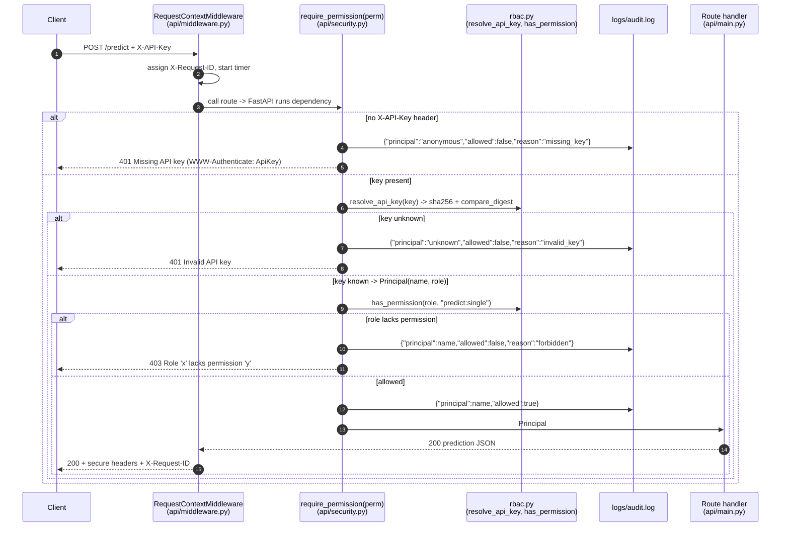

# Lab 6 — ML Pipeline with Access Control (RBAC)

> Educational project on synthetic data. Not for clinical use.

This document explains how the project decides **who** may use the readmission
model and **what** each caller may do, both in the REST API and in the
command-line ML pipelines. Every term is defined the first time it is used.

Files that implement Lab 6:

| File | Role in Lab 6 |
|------|---------------|
| `configs/access_control.yaml` | The policy: roles, their permissions, and the endpoint-to-permission map. |
| `src/security/rbac.py` | Loads the policy, resolves API keys, checks permissions, guards pipelines, writes the audit log. |
| `api/security.py` | FastAPI dependency `require_permission(...)` that returns 401 or 403. |
| `api/main.py` | Attaches `Depends(require_permission("..."))` to each protected route. |
| `pipelines/training_pipeline.py`, `pipelines/validation_pipeline.py`, `pipelines/retraining_pipeline.py`, `scripts/register_model.py` | Call `require_pipeline_permission(...)` before doing any work. |
| `tests/security/test_rbac.py` | Role x endpoint matrix, 401/403 tests, audit-log tests, pipeline guard tests. |
| `.github/workflows/model-training.yml` | `rbac-negative-test` job proves a viewer key cannot train in CI. |
| `.env.example` | Fake demo keys, one per role. |
| `logs/audit.log` | Append-only record of every allow/deny decision. |

---

## 1. Core ideas

**RBAC (Role-Based Access Control)** — permissions are given to *roles*
(job functions such as "clinician"), and each caller is assigned exactly one
role. To change what a person may do you change their role, not a long list of
individual rights. This is easier to review than per-user rules: the whole
policy fits in one 60-line YAML file.

**Permission** — a named action string such as `predict:single` or
`pipeline:train`. The format is `resource:action`.

**Principal** — the authenticated caller: a human-readable name plus a role,
for example `Principal(name="demo-clinician", role="clinician")`.

**Authentication vs authorization**

| | Question it answers | Mechanism here | Failure code |
|---|---|---|---|
| **Authentication** (authN) | "Who are you?" | `X-API-Key` header is hashed and looked up in the key table (`resolve_api_key`) | **401 Unauthorized** — missing or unknown key |
| **Authorization** (authZ) | "Are you allowed to do this?" | Role's permissions from `configs/access_control.yaml` (`has_permission`) | **403 Forbidden** — known key, wrong role |

Why two different codes? A 401 tells the client "send valid credentials and
try again". A 403 tells the client "we know who you are; retrying with the same
key will never work". Mixing them up makes debugging and attack detection
harder. The 401 response also carries the header `WWW-Authenticate: ApiKey`,
which HTTP requires for 401 responses.

**Least privilege** — every role receives only the permissions its job needs.
If a key leaks, the damage is limited to what that one role can do.

**Deny by default** — a role that is not in the policy, or a permission that is
not listed, is refused. `has_permission("nonexistent", "model:read")` returns
`False`. Nothing is allowed unless the policy says so.

---

## 2. Roles

| Role | Who it represents | Permissions |
|------|-------------------|-------------|
| `viewer` | Auditor, dashboard, manager | `model:read` |
| `clinician` | Doctor or nurse at the point of care | `model:read`, `predict:single`, `predict:explain` |
| `analyst` | Population-health / quality analyst | `model:read`, `predict:single`, `predict:batch`, `monitor:drift` |
| `ml_engineer` | Person who operates the ML lifecycle | analyst's four + `pipeline:train`, `pipeline:validate`, `pipeline:retrain`, `model:register` |
| `admin` | Platform owner, break-glass account | `*` (wildcard = every permission) |

`allowed_roles` in the YAML lists the five valid role names. `load_policy()`
raises `ValueError` if the file defines any other role, and the key loader
raises `ValueError` if `API_KEYS` assigns a role that does not exist. A typo
such as `admn` therefore fails loudly at start-up instead of silently creating
a new role.

## 3. Permission matrix (API)

Verified by `tests/security/test_rbac.py::test_rbac_matrix` (5 roles x 5
protected endpoints, each asserting exactly 200 or 403).

| Endpoint | Permission | viewer | clinician | analyst | ml_engineer | admin |
|----------|-----------|:---:|:---:|:---:|:---:|:---:|
| `GET /model-info` | `model:read` | 200 | 200 | 200 | 200 | 200 |
| `POST /predict` | `predict:single` | 403 | 200 | 200 | 200 | 200 |
| `POST /predict/explain` | `predict:explain` | 403 | 200 | 403 | 403 | 200 |
| `POST /predict/batch` | `predict:batch` | 403 | 403 | 200 | 200 | 200 |
| `POST /monitor/drift` | `monitor:drift` | 403 | 403 | 200 | 200 | 200 |

Public (no key needed): `GET /`, `GET /health`, `GET /ready`, `GET /metrics`.
They are public because Kubernetes liveness/readiness probes and the Prometheus
scraper must reach them without holding a secret, and they return no patient
data.

Pipeline permissions (CLI, not HTTP):

| Pipeline / script | Permission | Roles allowed |
|-------------------|-----------|---------------|
| `python -m pipelines.validation_pipeline` (`make validate-data`) | `pipeline:validate` | ml_engineer, admin |
| `python -m pipelines.training_pipeline` (`make train`) | `pipeline:train` | ml_engineer, admin |
| `python -m pipelines.retraining_pipeline` (`make retrain`) | `pipeline:retrain` | ml_engineer, admin |
| `python -m scripts.register_model` | `model:register` | ml_engineer, admin |

## 4. Why each role gets what it gets (least-privilege rationale)

- **viewer: only `model:read`.** An auditor needs to see which model version is
  live, its threshold and its test metrics. Scoring patients is not part of the
  job, so a leaked viewer key cannot be used to submit or infer patient data.
- **clinician: single prediction + explanation, but no batch.** A clinician
  scores the patient in front of them and needs to know *why* the model flagged
  them (the SHAP explanation). Batch scoring is denied because a CSV upload
  of up to 10,000 rows would let one stolen clinician key score and export a
  whole population at once — a **bulk data exfiltration** risk (exfiltration =
  copying data out of the organisation without authorization). One-at-a-time
  access limits how much a compromised account can extract, and the rate limit
  (60 requests/minute by default) caps it further.
- **analyst: batch + drift, but no explanation, no training.** Population work
  needs batch scoring and drift reports. Per-patient explanations are a clinical
  tool and are not needed for aggregate analysis, so they are withheld.
- **ml_engineer: pipelines + registry.** Only the people who own the model may
  produce a new one. If anyone could run training, an attacker could submit
  manipulated training data or parameters and produce a model that
  under-predicts risk for some group. That is **model poisoning** (deliberately
  corrupting a model through its training process). Restricting
  `pipeline:train` / `pipeline:retrain` / `model:register`, and recording the
  trainer's name in `models/model_metadata.json` (`trained_by`), makes every
  model traceable to an accountable person. The ml_engineer does not get
  `predict:explain` because it is not needed to operate pipelines.
- **admin: `*`.** Needed for emergencies and setup. It should be issued to as
  few people as possible, because it bypasses every other restriction.

## 5. Request flow



Each failure also increments the Prometheus counter
`auth_failures_total{reason="missing_key"|"invalid_key"|"forbidden"}`, so a
spike of 401s (someone guessing keys) is visible in Grafana.

## 6. How keys are stored and compared

Keys are supplied only through the environment variable `API_KEYS`, in the
format `name:role:key,name:role:key`. They are never in code, in the YAML, or
in the Docker image.

1. **Hashing.** `_key_table()` immediately replaces each raw key with its
   **SHA-256 hash** (a one-way fingerprint: easy to compute from the key,
   infeasible to reverse). Only `(hash, Principal)` pairs are kept in memory.
   A memory dump, a debugger, or an accidental log of the key table shows
   hashes, not usable keys. `test_only_hashes_kept_in_memory` checks this.
2. **Lookup.** A presented key is hashed the same way and compared with every
   stored hash.
3. **Constant-time comparison.** A normal `==` on strings stops at the first
   character that differs, so comparing against a wrong guess that shares a
   longer prefix takes slightly longer. An attacker sending many requests and
   measuring response times could, in principle, discover a secret one
   character at a time. This is a **timing attack**. `hmac.compare_digest`
   always takes the same time regardless of where the strings differ, and the
   loop in `resolve_api_key` does not stop early on a match, so total time also
   does not reveal *which* entry matched.
4. **No echo.** Error messages never repeat the presented key
   (`test_wrong_key_is_401` asserts the wrong key is absent from the response),
   and the rate limiter keys on a hash of the API key, not the key itself.

Why hash API keys with plain SHA-256 instead of bcrypt (the usual choice for
passwords)? These keys are long random strings (32 bytes from
`secrets.token_urlsafe(32)`), so brute-forcing the hash is infeasible; slow
password hashes matter for short human-chosen passwords. This is a reasonable
trade-off for a lab; section 10 lists what production would use.

## 7. Audit log

`audit_log()` appends one **JSON line** (one complete JSON object per line, so
the file can be streamed and parsed line by line) to `logs/audit.log` for every
decision, allowed or denied. Path can be changed with `AUDIT_LOG_PATH`.

Fields: `timestamp` (UTC ISO-8601), `principal` (name, or `anonymous` /
`unknown`), `role`, `action` (the permission), `resource`
(`"METHOD /path"` or `"pipeline"`), `allowed`, and optionally `reason`,
`request_id`, `client_ip`. The raw key is **never** written
(`test_raw_keys_never_in_audit_log`).

Real line from an API run (clinician tried batch scoring):

```json
{"timestamp": "2026-10-06T11:06:45.988113+00:00", "principal": "demo-clinician", "role": "clinician", "action": "predict:batch", "resource": "POST /predict/batch", "allowed": false, "reason": "forbidden", "request_id": "1234dd0c-379e-4c80-8e1c-84cc54319397", "client_ip": "127.0.0.1"}
```

Real line from `logs/audit.log` (a viewer key tried to train):

```json
{"timestamp": "2026-10-06T11:08:10.011484+00:00", "principal": "view", "role": "viewer", "action": "pipeline:train", "resource": "pipeline", "allowed": false}
```

The `request_id` is the same value returned in the `X-Request-ID` response
header and printed in the structured application log, so one request can be
traced across all three.

Why log allowed requests too? An audit answers "who did what, when". A
legitimate-looking key used at 3 a.m. from an unusual IP only shows up if
successes are recorded as well.

## 8. Pipeline-level RBAC

The API is not the only way to touch the model. Anyone with shell access could
run `python -m pipelines.training_pipeline`. So the pipelines check permissions
too:

- `require_pipeline_permission(permission)` reads `PIPELINE_API_KEY`, resolves
  it against the same `API_KEYS` table, checks the role, writes an audit line
  (`resource: "pipeline"`), and raises `PermissionError` if denied.
- The pipeline's `main()` catches it, prints `ACCESS DENIED: <reason>` to
  stderr and exits with code **2**, so CI marks the step as failed. The check
  runs *before* any data is read.
- On success the principal name is returned and stamped into
  `models/model_metadata.json` as `trained_by`.

**Fail-closed switch.** Enforcement is controlled by `ENFORCE_PIPELINE_RBAC`.
The code is `os.getenv("ENFORCE_PIPELINE_RBAC", "true").lower() == "false"`:
only the exact value `false` (any case) turns the check off. If the variable is
unset, empty, misspelled or anything else, enforcement stays on. A
configuration mistake therefore locks the pipeline rather than opening it
(**fail-closed**). When disabled, the caller is recorded as `local-dev`
(training/validation) or `local-dev (RBAC disabled)` (retraining).

`make` targets load `.env` (or `.env.example` if `.env` does not exist) and
export it, so `make train` runs with `PIPELINE_API_KEY=demo-ml-engineer-key-change-me`
and `ENFORCE_PIPELINE_RBAC=true`.

Note: the artifacts currently in `models/` show `"trained_by": "local-dev"`,
meaning they were produced with RBAC disabled. Re-running `make train` will
record `demo-ml-engineer` instead.

## 9. Enforcement in CI (`.github/workflows/model-training.yml`)

Two jobs:

1. **`rbac-negative-test`** — sets `ENFORCE_PIPELINE_RBAC=true`,
   `API_KEYS=ci-viewer:viewer:ci-viewer-only-key` and
   `PIPELINE_API_KEY=ci-viewer-only-key`, then runs
   `python -m pipelines.training_pipeline` and **expects it to fail**. If
   training succeeds, the job prints `RBAC gate FAILED — viewer was allowed to
   train` and exits 1. This is a *negative test*: it proves the gate rejects
   what it should, not just that the happy path works. The key is an ephemeral
   CI-only value with only `model:read`, so it is not a secret.
2. **`train`** (`needs: [rbac-negative-test]`) — runs only if the negative test
   passed. Uses the real `API_KEYS` and `PIPELINE_API_KEY` repository secrets
   (an ml_engineer principal), checks they are set without printing them, then
   runs generate -> validate (`pipeline:validate`) -> preprocess -> train
   (`pipeline:train`) and uploads `models/` plus `logs/audit.log` as an
   artifact.

`retraining.yml` also runs the retraining pipeline with RBAC enforced
(`pipeline:retrain`). See `docs/ci_cd_pipeline.md` for all workflows.

Note: these workflows have not yet been executed on GitHub (see the
validation status in `README.md`).

## 10. Live demo

Start the API (the Makefile exports the demo keys from `.env.example`):

```bash
make run-api            # http://127.0.0.1:8000
```

In a second terminal:

```bash
BASE=http://127.0.0.1:8000

# 1) Public endpoint: no key needed -> 200
curl -s -o /dev/null -w "%{http_code}\n" $BASE/health

# 2) No key -> 401 {"detail":"Missing API key"}
curl -s -w "\n%{http_code}\n" -X POST $BASE/predict \
  -H "Content-Type: application/json" -d @data/sample_input.json

# 3) Wrong key -> 401 {"detail":"Invalid API key"}
curl -s -w "\n%{http_code}\n" -X POST $BASE/predict \
  -H "X-API-Key: not-a-real-key" \
  -H "Content-Type: application/json" -d @data/sample_input.json

# 4) Viewer key on /predict -> 403 {"detail":"Role 'viewer' lacks permission 'predict:single'"}
curl -s -w "\n%{http_code}\n" -X POST $BASE/predict \
  -H "X-API-Key: demo-viewer-key-change-me" \
  -H "Content-Type: application/json" -d @data/sample_input.json

# 5) Clinician key on /predict -> 200 prediction JSON
curl -s -w "\n%{http_code}\n" -X POST $BASE/predict \
  -H "X-API-Key: demo-clinician-key-change-me" \
  -H "Content-Type: application/json" -d @data/sample_input.json

# 6) Clinician key on /predict/batch -> 403 (bulk scoring not allowed)
curl -s -w "\n%{http_code}\n" -X POST $BASE/predict/batch \
  -H "X-API-Key: demo-clinician-key-change-me" \
  -F "file=@data/sample_batch_input.csv;type=text/csv"

# 7) Analyst key on /predict/batch -> 200, CSV saved to predictions.csv
curl -s -X POST $BASE/predict/batch \
  -H "X-API-Key: demo-analyst-key-change-me" \
  -F "file=@data/sample_batch_input.csv;type=text/csv" -o predictions.csv

# 8) See the decisions
tail -n 7 logs/audit.log
```

Pipeline denial (does not touch any data because the check runs first):

```bash
set -a; source .env.example; set +a
PIPELINE_API_KEY=demo-viewer-key-change-me .venv/bin/python -m pipelines.training_pipeline
echo "exit code: $?"
# ACCESS DENIED: Role 'viewer' is not permitted to perform 'pipeline:train'
# exit code: 2
```

Automated proof: `make test-security` runs the full matrix.

## 11. Limitations and what production would use

| Lab implementation | Limitation | Production alternative |
|---|---|---|
| Static API keys in an env var | No expiry, shared by whoever has it, rotation means restarting the API | **OAuth 2.0 / OpenID Connect (OIDC)** via an identity provider (Keycloak, Azure AD, Okta): users log in, receive short-lived tokens |
| Key -> role lookup table | Role is fixed per key, no user identity | **JWT** (JSON Web Token: a signed token carrying user ID, role claims and expiry) validated on each request |
| `API_KEYS` in `.env` / Kubernetes Secret | Plain text at rest on the host | **Secrets manager** (AWS Secrets Manager, HashiCorp Vault) with **automatic key rotation** and per-client keys |
| Roles in a YAML file in the repo | Changing access needs a code change and redeploy | Central policy engine (e.g. Open Policy Agent) or identity-provider groups |
| Audit log as a local file | Can be edited or lost with the container | Ship to append-only, centralised storage (SIEM, CloudWatch, Loki) with retention |
| Coarse permissions | No per-patient or per-ward restriction | Attribute-based access control (ABAC), e.g. clinician sees only their ward's patients |
| SHA-256 of keys | Fine for long random keys, not for passwords | bcrypt/argon2 for any human-chosen secret |
| Rate limit in process memory | Per replica, reset on restart | Rate limiting at an API gateway shared by all replicas |
| Single `PIPELINE_API_KEY` | Shared CI identity | Workload identity / OIDC tokens issued per CI run |

Also: TLS (HTTPS) must terminate in front of the API in any real deployment,
otherwise the `X-API-Key` header travels in clear text.

## 12. Likely viva questions

1. **What is RBAC?** Permissions are attached to roles; callers get a role. It keeps the policy small and reviewable.
2. **401 vs 403?** 401 = we cannot identify you (missing/invalid key). 403 = we know you, but your role lacks the permission.
3. **Where is the policy?** `configs/access_control.yaml`; enforced by `src/security/rbac.py` and `api/security.py`.
4. **Why can't a clinician batch-score?** Bulk scoring of up to 10,000 rows from one stolen key would enable mass data exfiltration; clinicians only need one patient at a time.
5. **Why can only ml_engineer/admin train?** To prevent model poisoning and to make every model traceable to an accountable person (`trained_by`).
6. **How are keys stored?** Only SHA-256 hashes in memory; raw keys come from the `API_KEYS` env var and are never logged.
7. **What is a timing attack and how do you prevent it?** Learning a secret from how long comparisons take; `hmac.compare_digest` takes constant time and the loop never exits early.
8. **What does the audit log record?** Timestamp, principal name, role, action, resource, allowed, and reason/request_id/client_ip — never the key.
9. **What happens if `ENFORCE_PIPELINE_RBAC` is misspelled?** RBAC stays on. Only the exact value `false` disables it (fail-closed).
10. **How does CI prove RBAC works?** `rbac-negative-test` runs training with a viewer key and fails the job if training succeeds; the real `train` job depends on it.
11. **Why are /health and /metrics public?** Probes and Prometheus need them without secrets, and they expose no patient data.
12. **What happens with an unknown role in `API_KEYS`?** `ValueError` at load time — misconfiguration fails loudly.
13. **How is admin different?** Wildcard `*` matches every permission; keep it rare.
14. **What would you change for production?** OIDC/JWT, secrets manager with rotation, central audit storage, TLS, gateway rate limiting.
