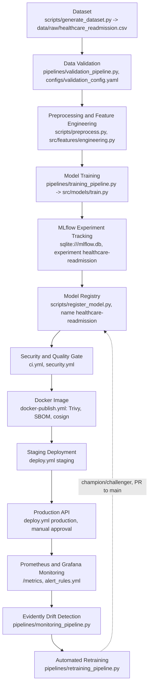
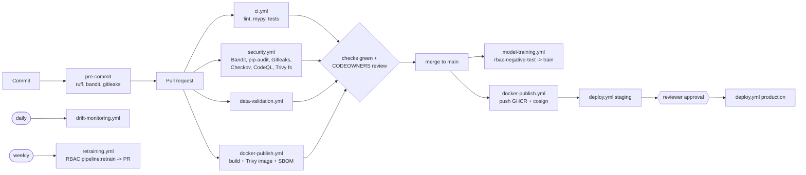
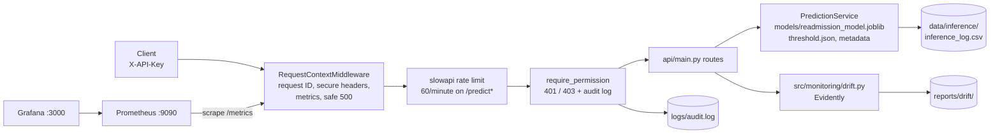

# Architecture

> Educational project on synthetic data. Not for clinical use.

## 1. End-to-end lifecycle

Lab 6 access control sits across this flow: validation, training, retraining
and registration call `require_pipeline_permission(...)`, and the production
API checks every protected request with `require_permission(...)`.

## 2. CI/CD flow

Details: `docs/ci_cd_pipeline.md`.

## 3. Runtime components

## 4. Component responsibilities

| Layer | Module | Responsibility |
|-------|--------|----------------|
| Schema | `src/features/schema.py` | Single source of truth for column names, allowed categories and numeric ranges, shared by validation, training and the API. |
| Data | `src/data/generate.py`, `preprocess.py`, `validation.py` | Synthetic data, stratified split, rule-based validation (columns, types, categories, missing %, ranges, duplicate IDs, schema change, target balance, leakage). |
| Features | `src/features/engineering.py` | `FeatureEngineer` (pulse pressure, utilization score, BP/glucose/polypharmacy flags) and `OutlierClipper` (1st-99th percentile). |
| Model | `src/models/pipeline_factory.py`, `train.py`, `evaluate.py`, `risk.py` | Builds the single sklearn `Pipeline`, tunes 3 models, calibrates, picks the threshold, writes artifacts and figures, maps probability to risk level. |
| Monitoring | `src/monitoring/drift.py`, `performance.py`, `retrain_policy.py` | Evidently drift report, labelled-performance check, retrain decision. |
| Security | `src/security/rbac.py`, `api/security.py` | Lab 6 RBAC and audit. |
| API | `api/*` | HTTP layer, validation, logging, metrics. |
| Orchestration | `pipelines/*`, `dvc.yaml` | Prefect flows (set `USE_PREFECT=false` to run as plain Python) and DVC stages for reproducibility. |

## 5. Key design decisions

- **One Pipeline object for training and serving.** Imputation, clipping, scaling and encoding are fitted once and saved with the classifier, so the API cannot apply different preprocessing from training (no "training/serving skew").
- **Selection by cross-validated PR-AUC, not test score.** The test set is used once for the final report, so reported numbers are honest.
- **Calibration.** Class weighting distorts probabilities; isotonic calibration makes a reported 0.40 mean roughly 40% observed risk.
- **Recall-oriented threshold** chosen on out-of-fold training predictions (0.1327).
- **Fail-safe API start-up.** If artifacts are missing the API still starts; `/ready` returns 503 so an orchestrator does not route traffic to it.
- **Security as configuration.** Roles in YAML, keys in env vars, thresholds in `configs/monitoring_config.yaml` — reviewers can see policy without reading code.
