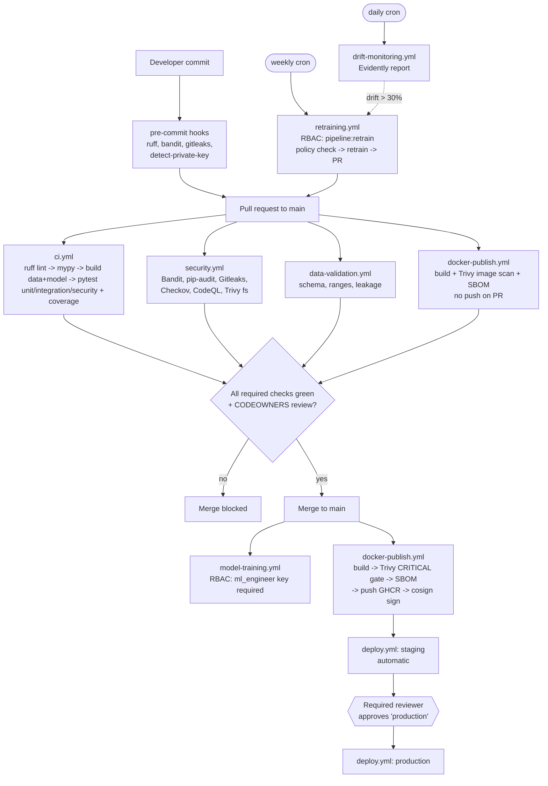

# Lab 5 — Secure CI/CD Pipeline with GitHub Actions

> Educational project. Synthetic data only. Not for clinical use.

This document explains every workflow in `.github/workflows/`, every security
gate, how production approval works, how secrets are handled and why each job
gets only the token permissions it needs. It also shows where **Lab 6 (ML
pipeline access control / RBAC)** is enforced inside CI.

## 1. Vocabulary (one line each)

| Term | Meaning |
|------|---------|
| **CI** (Continuous Integration) | Automatically build and test every change before it is merged. |
| **CD** (Continuous Delivery/Deployment) | Automatically package and ship a tested change to an environment. |
| **GitHub Actions** | GitHub's built-in automation service; a *workflow* is a YAML file in `.github/workflows/`. |
| **Workflow / job / step** | A workflow contains jobs (each on a fresh VM, the *runner*); a job contains steps (commands or reusable *actions*). |
| **Trigger (`on:`)** | The event that starts a workflow: `pull_request`, `push`, `schedule` (cron), `workflow_dispatch` (manual button), `workflow_run` (after another workflow). |
| **GITHUB_TOKEN** | A short-lived token GitHub creates for each run; `permissions:` controls what it may do. |
| **Secret** | An encrypted value (Settings -> Secrets) injected at runtime and masked as `***` in logs. |
| **Environment** | A named deployment target (staging, production) that can hold its own secrets and require reviewers. |
| **Artifact** | A file a job uploads (coverage report, model, SBOM) that can be downloaded later. |
| **SARIF** | Static Analysis Results Interchange Format — a JSON format GitHub shows in Security -> Code scanning. |
| **DevSecOps** | Putting security checks *inside* the delivery pipeline instead of after it ("shift left"). |
| **ruff** | A very fast Python linter and formatter (style errors, unused imports, simple bugs). |
| **mypy** | A static type checker for Python type hints. |
| **pytest / coverage** | Python test runner / tool that measures which lines the tests executed. |
| **Bandit** | Python SAST (Static Application Security Testing): finds insecure code patterns. |
| **pip-audit** | Checks pinned Python packages against known-vulnerability databases (PyPI/OSV advisories). |
| **Gitleaks** | Scans files and git history for committed secrets (API keys, tokens, private keys). |
| **Checkov** | Scans infrastructure-as-code (Terraform, Kubernetes, Dockerfile, GitHub workflows) for misconfigurations. |
| **DAST** | Dynamic Application Security Testing: attacking the *running* app over HTTP from the outside, without reading its code. |
| **OWASP ZAP** | Zed Attack Proxy, a free DAST tool from OWASP (Open Worldwide Application Security Project) that sends attack requests and reports what it finds. |
| **CodeQL** | GitHub's semantic code analysis; tracks data flow to find injection, path traversal, etc. |
| **Trivy** | Scanner for CVEs in OS packages and libraries, in a folder or a container image; also finds secrets/misconfig. |
| **CVE** | Common Vulnerabilities and Exposures — a public ID for a known security bug. |
| **SBOM** | Software Bill of Materials — a list of every package inside the image (here in **SPDX** format). |
| **cosign / Sigstore** | Tools to cryptographically sign container images; *keyless* uses the CI run's OIDC identity instead of a stored key. |
| **OIDC** | OpenID Connect — the runner proves "I am workflow X of repo Y" with a short-lived token. |
| **GHCR** | GitHub Container Registry (`ghcr.io`), where images are published. |
| **Dependabot** | GitHub bot that opens PRs to update dependencies (`.github/dependabot.yml`). |
| **RBAC** | Role-Based Access Control — permissions are granted to roles, users get roles (Lab 6). |

## 2. CI/CD flow



## 3. The workflows

| File | Triggers | What it does | Fails when |
|------|----------|--------------|------------|
| `ci.yml` | PR, push to main, manual | **lint** (ruff check + format check), **type-check** (mypy `src api`), **test**: generates data, preprocesses, trains (RBAC off for this throw-away build), then runs `tests/unit`, `tests/integration`, `tests/security` with coverage, uploads `coverage-report` artifact (XML + HTML). | any lint/type error, any failing test |
| `security.yml` | PR, push, weekly cron, manual | Six security gates (section 4); uploads SARIF to the Security tab. Weekly cron catches CVEs published *after* the code was merged. | any gate finds an issue above its threshold |
| `dast.yml` | PR, push to main, manual | Builds a model, starts the API on the runner (`ENV=ci`), waits for `/health`, runs an **OWASP ZAP API scan** driven by `/openapi.json` with the admin demo key as `X-API-Key`; uploads the `dast-zap-report` artifact (HTML/MD/JSON). See section 4.1. | any **High**-risk ZAP alert |
| `data-validation.yml` | changes to data code/config/params, manual | Regenerates data and runs `pipelines.validation_pipeline` (required columns, types, categories, missing %, ranges, duplicate IDs, schema change, target balance, leakage). | any validation rule fails |
| `model-training.yml` | manual, push to main changing data/params/model code | **rbac-negative-test** first proves a *viewer* key is denied training; then **train** runs validation -> preprocess -> training with `ENFORCE_PIPELINE_RBAC=true` and the `ml_engineer` key from secrets. Uploads `models/` + `logs/audit.log`. | RBAC misconfigured, secrets missing, training error |
| `docker-publish.yml` | PR (Docker-related paths), push to main, `v*.*.*` tags | Builds artifacts and the image, **Trivy image scan** (fails on CRITICAL), **SBOM** (SPDX), and — only on main/tags — pushes to GHCR and **cosign**-signs the digest. | CRITICAL CVE in image, build error |
| `deploy.yml` | after successful Docker Publish on main, manual | Staging deploy automatically; production deploy waits for **manual approval** (section 5). Without kube-config secrets it runs in example mode. | rollout fails |
| `drift-monitoring.yml` | daily cron, manual | Builds reference data/model, seeds demo inference data, runs `pipelines.monitoring_pipeline` (Evidently), uploads `reports/drift/`, warns if drift detected. | pipeline error |
| `retraining.yml` | weekly cron, manual | Runs `pipelines.retraining_pipeline` with RBAC enforced (`pipeline:retrain`); retrains only if the policy (drift > 30%, ROC-AUC < 0.70, positive-rate shift > 10%) says so; uploads artifacts and opens a PR with the new metrics for human review. | RBAC denied, pipeline error |

Supporting files: `.github/dependabot.yml` (weekly pip, github-actions, docker
updates), `.github/CODEOWNERS` (who must review which paths),
`.github/pull_request_template.md` (security checklist),
`.github/ISSUE_TEMPLATE/` (bug report, security issue), `SECURITY.md`
(private vulnerability reporting).

## 4. Security gates — what, why, and why it fails the build

| Gate | Tool | Catches (example) | Threshold that fails | Why fail the build |
|------|------|-------------------|----------------------|--------------------|
| Python SAST | **Bandit** (`-ll -ii`) | `eval()`, `pickle.loads` on user data, `subprocess(shell=True)`, hardcoded passwords, `yaml.load` without SafeLoader, binding to all interfaces | any issue of MEDIUM+ severity and MEDIUM+ confidence | These patterns are directly exploitable (code execution, injection). Low findings are still reported in SARIF. |
| Dependency CVEs | **pip-audit** on `requirements-api.txt` | a pinned `fastapi`/`starlette` version with a published CVE | any known vulnerability | The container ships these packages; a known CVE is a known attack path. Fix = bump the pin. |
| Secrets | **Gitleaks** (full history, `--redact`) | AWS keys, GitHub tokens, private keys, high-entropy API keys | any leak not in the narrow `.gitleaks.toml` allowlist | A pushed secret must be considered compromised; blocking forces rotation before merge. |
| IaC | **Checkov** | S3 bucket without encryption, container running as root, missing resource limits, workflow with write-all token | any failed check (skips must be justified inline with `#checkov:skip=ID:reason`) | Misconfiguration is the #1 cloud breach cause; catching it in a PR is cheaper than in production. |
| Semantic SAST | **CodeQL** (`security-extended`) | user input flowing into a file path or SQL/command | alerts appear in Security tab; with branch protection "code scanning results" they block merge | Finds multi-line data-flow bugs Bandit's pattern matching misses. |
| Filesystem CVEs | **Trivy fs** | vulnerable libraries in lock/requirements files, committed secrets | any **CRITICAL** fixable CVE (`exit-code: 1`) | Spec requirement: the pipeline must fail on critical vulnerabilities. |
| Image CVEs | **Trivy image** (in `docker-publish.yml`) | vulnerable Debian packages in `python:3.11-slim`, vulnerable wheels | any **CRITICAL** fixable CVE — image is **never pushed** | Stops a vulnerable image from reaching the registry. |
| Supply chain | **SBOM** (anchore/Syft, SPDX) + **cosign** | n/a — provides evidence | n/a | SBOM answers "are we affected by new CVE X?" instantly; signature proves the image came from this workflow and was not tampered with. |
| Lab 6 RBAC | `require_pipeline_permission` | a key without `pipeline:train` trying to train | `PermissionError` -> non-zero exit | Proves only `ml_engineer`/`admin` can produce a model, and every attempt is in `logs/audit.log`. |

`ignore-unfixed: true` on Trivy means "fail only if a fixed version exists" —
otherwise the build could be blocked by a CVE nobody can fix yet.

### 4.1 DAST — scanning the running API with OWASP ZAP

**DAST (Dynamic Application Security Testing) means testing a running
application for security holes by sending it real HTTP requests from the
outside, the way an attacker would, without looking at its source code.**
Every gate above is *static* (it reads code, packages or config files); DAST
is the only one that checks how the deployed API actually *behaves* — missing
security headers, stack traces leaking in error responses, injection that only
shows up at runtime, endpoints reachable without a key.

What `.github/workflows/dast.yml` does, step by step:

1. Builds the model from scratch (the API needs one to serve `/predict`).
2. Starts the API with `ENV=ci`. `/openapi.json` (the machine-readable list of
   every endpoint and its parameters) is turned off only when
   `ENV=production`, so it is available here. `RATE_LIMIT` is raised so the
   scanner's thousands of requests are not all answered with `429`.
3. Polls `GET /health` until the API answers.
4. Runs `zaproxy/action-api-scan`: ZAP imports `/openapi.json`, then runs a
   *passive* scan (just reading responses: headers, cookies, error text) and
   an *active* scan (sending attack payloads: SQL/command injection, path
   traversal, buffer overflows, ...). `ZAP_AUTH_HEADER=X-API-Key` with the
   admin demo key makes ZAP add the key to every request, so the
   authenticated endpoints (`/predict`, `/model-info`, `/monitor/drift`, ...)
   are really tested instead of only returning `401`.
5. `scripts/zap_gate.py` reads `report_json.json`, prints alert counts per risk
   level (High / Medium / Low / Informational) and **fails the job only on a
   High** alert. Lower levels stay in the report for a human to review.
6. The HTML, Markdown and JSON reports are uploaded as the `dast-zap-report`
   artifact.

Known false positives are listed in `.zap/rules.tsv` as
`<rule id> TAB IGNORE TAB (why)`; ZAP skips those rules and the gate ignores
them, so every suppression is written down with its reason.

Run it locally (needs Docker Desktop running):

```bash
# terminal 1 — start a throw-away API on a spare port (non-production ENV)
set -a; source .env.example; set +a
RATE_LIMIT=100000/minute .venv/bin/python -m uvicorn api.main:app --host 127.0.0.1 --port 8090

# terminal 2 — ZAP in Docker scans it; reports go to reports/dast/
make dast DAST_PORT=8090
```

## 5. Manual approval before production

`deploy.yml` has two jobs. `staging` runs automatically. `production` declares:

```yaml
environment:
  name: production
```

One-time setup in **Settings -> Environments -> production**:

1. **Required reviewers**: add the people/teams who may approve (e.g. ML lead + security).
2. **Prevent self-review**: the person who triggered the run cannot approve it.
3. **Wait timer** (optional): e.g. 10 minutes of staging soak time.
4. **Deployment branches**: only `main` and `v*.*.*` tags may deploy.
5. **Environment secrets**: put `KUBE_CONFIG_PRODUCTION` here, not in repo secrets.

When the workflow reaches the production job, GitHub pauses it and notifies the
reviewers; the job (and access to its environment secrets) starts only after
someone clicks **Approve and deploy**. The approval is recorded in the run log
(audit trail). The production job needs `staging` to have succeeded first.

## 6. How secrets are handled

- **Never in code or images.** The Dockerfile has no secrets; the API reads
  `API_KEYS` from the environment. `.env` is git-ignored; `.env.example`
  contains only obviously fake `demo-*-key-change-me` values.
- **GitHub secrets** used: `API_KEYS`, `PIPELINE_API_KEY` (repo-level, for
  training/retraining), `KUBE_CONFIG_STAGING` / `KUBE_CONFIG_PRODUCTION`
  (environment-scoped). They are passed via `env:` to the step that needs them
  and never echoed; GitHub masks them in logs anyway.
- **Fork PRs get no secrets**, so PR jobs use ephemeral CI-only keys (e.g.
  `ci-viewer-key`) that exist only in the throw-away runner and grant nothing
  outside it.
- **Kube-config** is written with `umask 077` to `$RUNNER_TEMP` (deleted after
  the job), never to the workspace.
- **Registry login** uses the per-run `GITHUB_TOKEN`; **signing** uses keyless
  OIDC — there is no long-lived signing key to steal.
- **Detection**: Gitleaks runs in pre-commit and in CI over the full history.
- **Production recommendation**: AWS Secrets Manager / Vault + External Secrets
  Operator, key rotation, one key per client.

## 7. Least-privilege token permissions

Every workflow starts with:

```yaml
permissions:
  contents: read
```

so the default `GITHUB_TOKEN` can only read the code. Jobs that need more ask
for exactly that, and nothing else:

| Job | Extra permission | Why |
|-----|------------------|-----|
| security.yml: Bandit, Checkov, CodeQL, Trivy | `security-events: write` | upload SARIF to code scanning |
| security.yml: CodeQL | `actions: read` | CodeQL reads workflow run info |
| docker-publish.yml | `packages: write` | push image to GHCR |
| docker-publish.yml | `id-token: write` | request OIDC token for cosign keyless signing |
| retraining.yml: open-pr | `contents: write`, `pull-requests: write` | create a branch and open the retraining PR |

If an attacker compromised a dependency used in the `lint` job, the token there
could not push code, publish images or change settings.

Other hardening in every workflow:

- `persist-credentials: false` on checkout — the token is not left in `.git/config` for later steps to steal.
- `concurrency` — a newer push cancels the stale run (deploy/training never cancel mid-way).
- `timeout-minutes` — a hung or abused job cannot run for 6 hours.
- Actions pinned to major versions; for maximum supply-chain safety pin to a full commit SHA (`uses: actions/checkout@<sha> # v4`) and let Dependabot bump them.
- No `pull_request_target` (which would run untrusted PR code with secrets).
- User-controlled values (`inputs.*`, `github.event.*`) are passed through `env:` and quoted, never interpolated directly into `run:` scripts (prevents script injection).

## 8. Running the same checks locally

```bash
make lint          # ruff
make type-check    # mypy
make test          # pytest + coverage
make security-scan # bandit + pip-audit (+ gitleaks, trivy, checkov if installed)
make dast          # OWASP ZAP DAST scan of a running API (Docker; see 4.1)
make ci            # all of the above
.venv/bin/pre-commit install   # run hooks on every commit
```

## 9. Viva quick answers

- **Why separate workflow files?** Different triggers, permissions and owners; a failing drift job must not block a PR.
- **Why build the model in CI?** Proves the data -> model path is reproducible and gives API tests a real model.
- **Why fail only on CRITICAL?** Balances safety and velocity; lower severities are still reported in the Security tab and tracked via Dependabot.
- **What stops a bad model from reaching production?** RBAC on training, human review of the retraining PR, Trivy/SBOM on the image, and manual approval on the production environment.
- **What if a secret is committed?** Gitleaks fails the build; rotate the secret immediately, then purge it from history.
